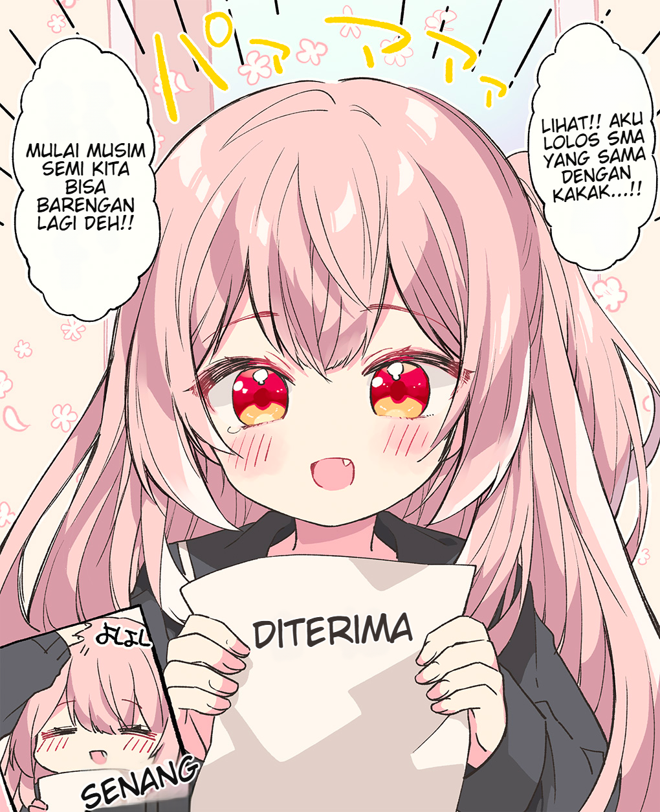
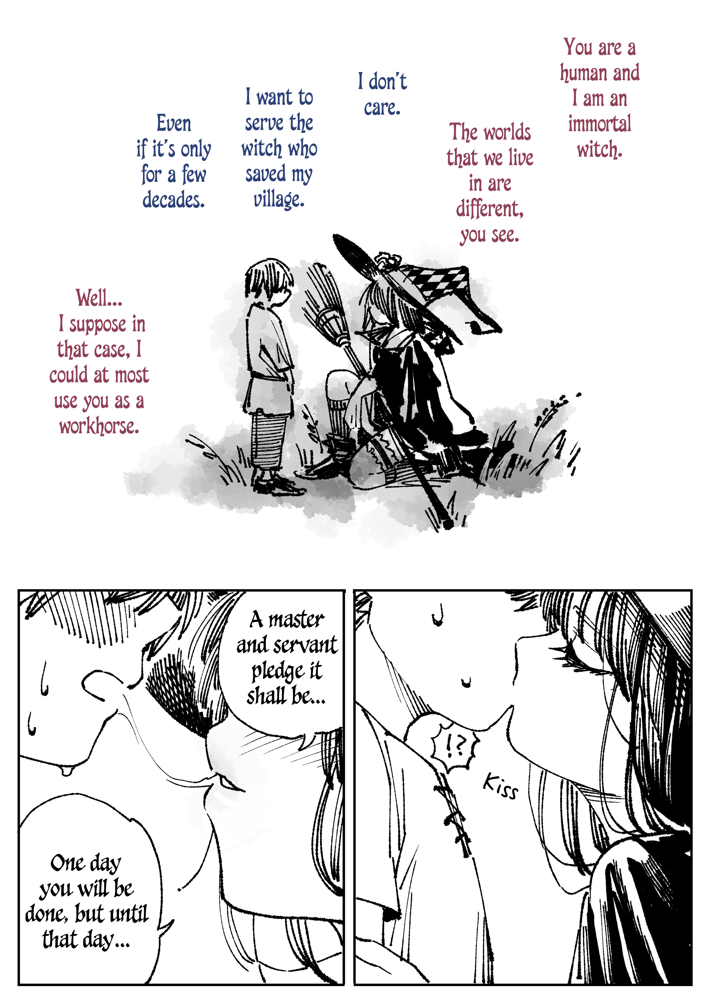
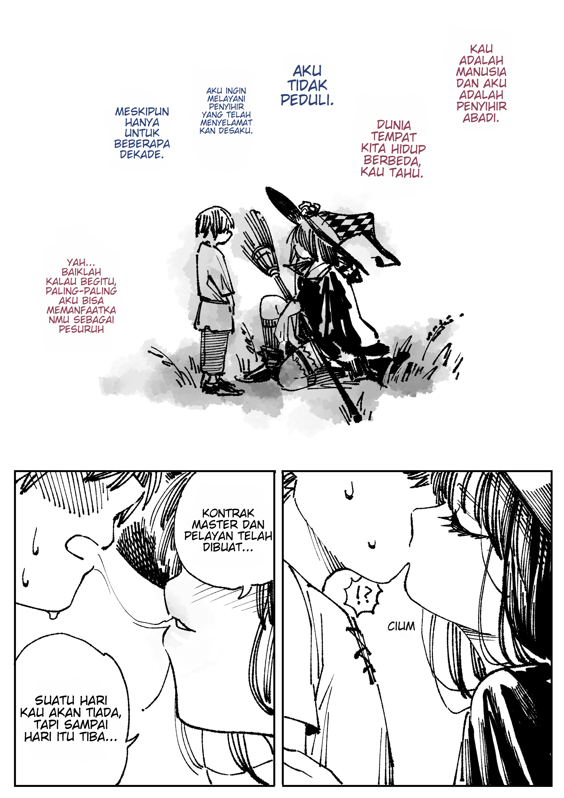
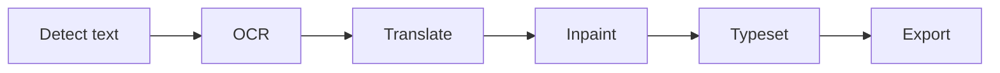

# Lumina — Illuminating every story

Lumina is a desktop application for manga, manhwa, and manhua translation. It automates the core pipeline — text detection, OCR, translation, inpainting, and typesetting — but every step stays editable: full automation is rarely accurate enough, so a light human pass is expected to polish the final result. All models run locally through ONNX Runtime; translation is the only step that calls external AI APIs.

## Table of Contents

- [Features](#features)
- [Showcase](#showcase)
- [How It Works](#how-it-works)
- [Architecture](#architecture)
- [Models](#models)
- [GPU Acceleration](#gpu-acceleration)
- [Installers](#installers)
- [Project File Format (.lmi)](#project-file-format-lmi)
- [Development](#development)
- [Roadmap](#roadmap)
- [License](#license)

## Features

- **Semi-automatic pipeline** — detection, OCR, translation, inpainting, and typesetting are automated, but every step stays editable: detected boxes can be re-ordered or corrected by hand, OCR text can be edited or retranslated per line, and inpaint masks are individual layers you can toggle, move, or remove before export.
- **Content-aware inpainting** with per-bubble masks, plus an automatic full-page mask from segmentation-based detection.
- **Selection tools** — lasso and rectangle with multi-selection refinement: Shift to add or merge, Alt to subtract.
- **Typesetting helpers** — auto-detected text color and slant, auto-fit fonts, per-layer typography.
- Project save/import in a single `.lmi` file; PNG/JPG export with drag-and-drop reordering.
- **GPU acceleration** with per-model execution provider control.

## Showcase

The following examples may not be frequently updated and may not represent the effect of the current main branch version.

<table>
  <thead>
    <tr>
      <th align="center" width="50%">Original Image</th>
      <th align="center" width="50%">Translated Image</th>
    </tr>
  </thead>
  <tbody>
    <tr>
      <td align="center" width="50%">
        <a href="showcase/1/before.png">
          
        </a>
        <br />
        <a href="https://x.com/rikak/status/1642727617886556160/photo/1">(Source @rikak)</a>
      </td>
      <td align="center" width="50%">
        <a href="showcase/1/after.png">
          
        </a>
        <br />
        <code>full pipeline</code>
      </td>
    </tr>
    <tr>
      <td align="center" width="50%">
        <a href="showcase/2/before.jpg">
          
        </a>
        <br />
        <a href="https://mangadex.org/title/d313c527-5a37-411f-b82b-3ca61feca13e">(Source: MangaDex)</a>
      </td>
      <td align="center" width="50%">
        <a href="showcase/2/after.png">
          
        </a>
        <br />
        <code>full pipeline</code>
      </td>
    </tr>
    <tr>
      <td align="center" width="50%">
        <a href="showcase/3/before.png">
          
        </a>
        <br />
        <a href="https://x.com/hiduki_yayoi/status/1645186427712573440/photo/2">(Source @hiduki_yayoi)</a>
      </td>
      <td align="center" width="50%">
        <a href="showcase/3/cleaned.png">
          
        </a>
        <br />
        <code>inpaint only — no typesetting</code>
      </td>
    </tr>
  </tbody>
</table>

## How It Works



Each step produces editable results: detected boxes can be re-ordered or corrected by hand, OCR text can be edited or retranslated per line, and inpaint masks are individual layers you can toggle, move, or remove before final export.

## Architecture

- **Electron shell** — three layers: `src/main/` (Node process: window, backend lifecycle, file I/O), `src/preload.ts` (context-isolated bridge), `src/renderer/` (UI, canvas, pipeline orchestration).
- **Python backend** — a FastAPI server on `localhost:8765`, spawned and stopped by the Electron main process. All model inference and translation calls go through its HTTP API.
- **ONNX Runtime** — every model runs locally as an ONNX graph; the backend resolves the execution provider at runtime.
- **Single IPC contract** — `src/shared/bridge.ts` defines every channel, payload, and shared type used across processes.

```
lumina/
├── src/
│   ├── main/          Electron main process (window, backend, project, export)
│   ├── preload.ts     Context-isolated IPC bridge
│   ├── renderer/      UI, canvas, pipeline orchestration
│   └── shared/        IPC contract shared with both processes
├── python/
│   ├── main.py        FastAPI entry point
│   ├── services/      Pluggable model registries (detect / ocr / inpaint / translate)
│   └── prompts/       Default translation instructions
├── models/            Model files for local development (see Models section)
└── cache/             Runtime cache (patches, extracted projects)
```

## Models

Models are managed in Settings → Models. They are not bundled with the app; each one is downloaded on demand or placed manually in a models directory.

The models directory is resolved in this order: the `LUMINA_MODEL_DIR` environment variable, the location saved in Settings → Models (via the “Models directory” card), or the platform default `userData/models` (`%APPDATA%\Lumina\models` on Windows). In a source checkout, set `LUMINA_MODEL_DIR` in `.env` (see [.env.example](.env.example)) to keep using the repo's `models/` folder.

| Category | Model          | Status          | Execution                        |
| -------- | -------------- | --------------- | -------------------------------- |
| Detect   | `rtdetr`       | Ready (default) | CUDA / DirectML / CPU            |
| Detect   | `rfdetr_seg`   | Ready           | CUDA / DirectML / CPU            |
| OCR      | `manga_ocr`    | Ready (default) | CUDA / DirectML (decoder on CPU) |
| OCR      | `baberu`       | Ready           | CUDA / DirectML (decoder on CPU) |
| OCR      | `ppocrv6`      | In development  | CUDA / DirectML / CPU            |
| OCR      | `paddleocr_vl` | In development  | CUDA or CPU (no DirectML)        |
| Inpaint  | `lama_manga`   | Ready (default) | CUDA or CPU (no DirectML)        |
| Inpaint  | `lama`         | Ready           | CPU only                         |

"Ready" models are stable; "In development" models work but may still have rough edges. `rtdetr` is the default detector because it is Apache-2.0 licensed; `rfdetr_seg` offers better segmentation quality but is trained on the Manga109 dataset and is restricted to academic/research use (see [License](#license)).

## GPU Acceleration

Lumina uses ONNX Runtime with GPU support where available.

- **One execution provider per environment.** The DirectML and CUDA wheels cannot coexist in a single Python environment. The bundled default is DirectML (works on any GPU); CUDA is an opt-in wheel.
- **`LUMINA_EP` environment variable** overrides the runtime preference: `auto` (CUDA → DirectML → CPU, falling back per wheel), `cuda` (CUDA, falling back to CPU — never DirectML), `dml`, or `cpu`.
- **Per-model preferences** are baked into each model's configuration. Some models cannot run on certain providers: `lama` is CPU-only (GPU acceleration is ignored when enabled), `lama_manga` and `paddleocr_vl` never use DirectML (CUDA when available, otherwise CPU), and some OCR models keep their autoregressive decoder on CPU regardless of the chosen provider.

## Installers

Prebuilt Windows installers ship with the DirectML runtime only (`Lumina-Setup-DML.exe`). DirectML runs on any GPU that supports DirectX 12 — including NVIDIA — and falls back to CPU on machines without a compatible GPU.

A CUDA installer is not available yet. Until one is released, CUDA acceleration requires running from source: set up the Python backend with the `onnxruntime-gpu[cuda,cudnn]` wheel (see [Development](#development)) and start the app with `npm start`.

## Project File Format (.lmi)

A `.lmi` file is a zip archive containing a `project.json` manifest plus the page images and inpaint mask patches. The manifest stores the page list, text detections, layers, typography, and a non-secret subset of the translation settings. API keys are never written to the file.

## Development

### Prerequisites

- Node.js (for Electron, esbuild, TypeScript)
- Python 3.13
- A GPU execution provider, if GPU acceleration is wanted:
  - NVIDIA: CUDA-enabled driver plus the `onnxruntime-gpu[cuda,cudnn]` wheel
  - Otherwise: the `onnxruntime-directml` wheel (any GPU) or plain CPU
- Model files placed in the models directory (or downloaded through Settings → Models once the app runs)

### Setup

```sh
# Python backend
python -m venv venv
venv\Scripts\pip install -r python\requirements.txt   # Windows
# source venv/bin/activate && pip install -r python/requirements.txt  # macOS/Linux

# Frontend
npm install
npm run build
npm start
```

The backend is started automatically by the Electron main process; no separate server setup is needed.

## Roadmap

See [TODO.md](TODO.md) for the current list of known issues and planned work.

## License

Lumina is released under the [MIT License](LICENSE). This license covers the source code and the application bundle only.

Model files are **not** included in the distribution and are **not** covered by this license. They are downloaded separately (via the app or manually), and each model carries its own license terms.

The default detector, `rtdetr`, is Apache-2.0 licensed. The segmentation detector `rfdetr_seg` (Koharu Layout RF-DETR Seg 2XL) is trained on the [Manga109](https://manga109.github.io/manga109-project-website/en/) dataset and is restricted to academic, non-commercial research use; it is offered as an optional model for that purpose only.
